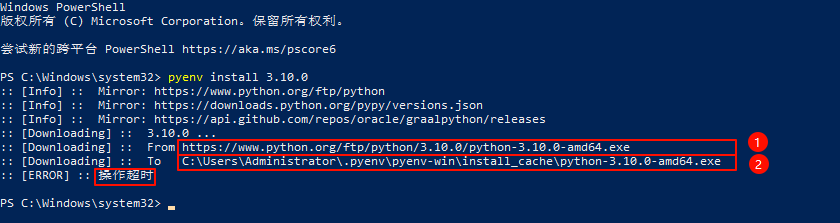
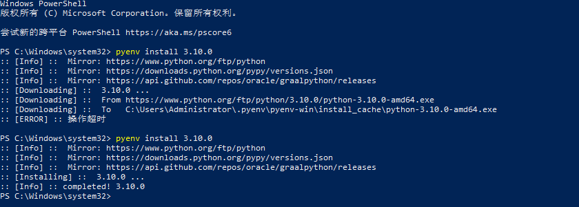
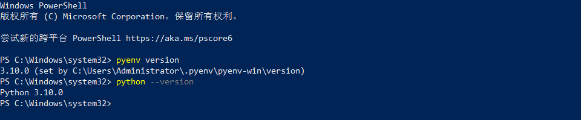

# pyenv for Windows 安装使用教程

## pyenv 功能

- 可以全局进行 Python 版本切换。
- 可以单个项目中进行 Python 版本切换。
- 可以使用环境变量覆盖 Python 版本。
- 能够同时搜索来自多个版本的 Python 的命令。

## 引用

> 使用的是@kirankotari 的[`pyenv-win`](https://github.com/pyenv-win/pyenv-win)分支--它会安装本地 Windows Python 版本。

## 快速开始

1. 管理员运行 PowerShell

   ```pwsh
   Invoke-WebRequest -UseBasicParsing -Uri "https://raw.githubusercontent.com/pyenv-win/pyenv-win/master/pyenv-win/install-pyenv-win.ps1" -OutFile "./install-pyenv-win.ps1"; &"./install-pyenv-win.ps1"
   ```

   - 这里可能会遇到无法加载文件，因为在此系统上禁止运行脚本错误
     > [`PowerShell 执行策略`](https://learn.microsoft.com/zh-cn/powershell/module/microsoft.powershell.core/about/about_execution_policies)

   1. 管理员 PowerShell
   2. Get-ExecutionPolicy 可查看当前将 PowerShell 执行策略
   3. 执行 Set-ExecutionPolicy -ExecutionPolicy RemoteSigned -Scope LocalMachine
   4. 重新执行步骤 1

2. 重新打开 PowerShell
3. 运行 `pyenv --version` 检查安装是否成功
4. 运行 `pyenv install -l` 检查 pyenv-win 支持的 Python 版本列表
5. 运行 `pyenv install <version>` 以安装支持的版本
6. 运行 `pyenv global <version>`将 Python 版本设置为全局版本
7. 检查您正在使用的 Python 版本及其路径

   ```plaintext
   > pyenv version
   <version> (set by \path\to\.pyenv\pyenv-win\.python-version)
   ```

8. 检查 Python 是否正常工作

   ```plaintext
   > python -c "import sys; print(sys.executable)"
   \path\to\.pyenv\pyenv-win\versions\<version>\python.exe
   ```

## pyenv-win 命令

```yml
commands     List all available pyenv commands
local        Set or show the local application-specific Python version
latest       Print the latest installed or known version with the given prefix
global       Set or show the global Python version
shell        Set or show the shell-specific Python version
install      Install 1 or more versions of Python
uninstall    Uninstall 1 or more versions of Python
update       Update the cached version DB
rehash       Rehash pyenv shims (run this after switching Python versions)
vname        Show the current Python version
version      Show the current Python version and its origin
version-name Show the current Python version
versions     List all Python versions available to pyenv
exec         Runs an executable by first preparing PATH so that the selected
Python version's `bin' directory is at the front
which        Display the full path to an executable
whence       List all Python versions that contain the given executable
```

## 下载 python 问题

- 可能会遇到请求操作问题
  > 
  - 解决办法（利用本地缓存安装）：
    1. 访问 https://www.python.org/ftp/python/3.10.0 (图中 ①)
    2. 找到并下载对应的安装包 python-3.10.0-amd64.exe (图中 ①)
    3. 打开 C:\Users\...\.pyenv\pyenv-win\install_cache (图中 ②)
    4. 将下载的安装包 python-3.10.0-amd64.exe 放入该目录
    5. 重新运行安装命令即可安装成功
    
- 环境变量问题
  > 如果执行了类似 pyenv install 3.10 + pyenv global 3.10 的操作。
  > 但是执行 pyenv version 得到的版本与执行 python --version 得到的版本不一致。
  - 解决办法：
    1. 右键此电脑，选择属性，选择高级系统设置
    2. 选择系统变量，将类似...\.pyenv\pyenv-win\bin 和...\.pyenv\pyenv-win\shims 的路径移到最前面（如果没有就手动配或去用户变量里面找并复制到系统变量中）
    3. 重启 PowerShell 执行 pyenv version 与 python --version 得到的版本是否一致
    
